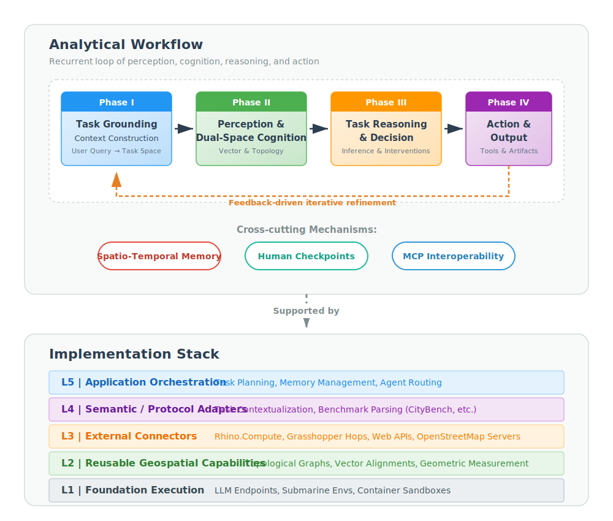
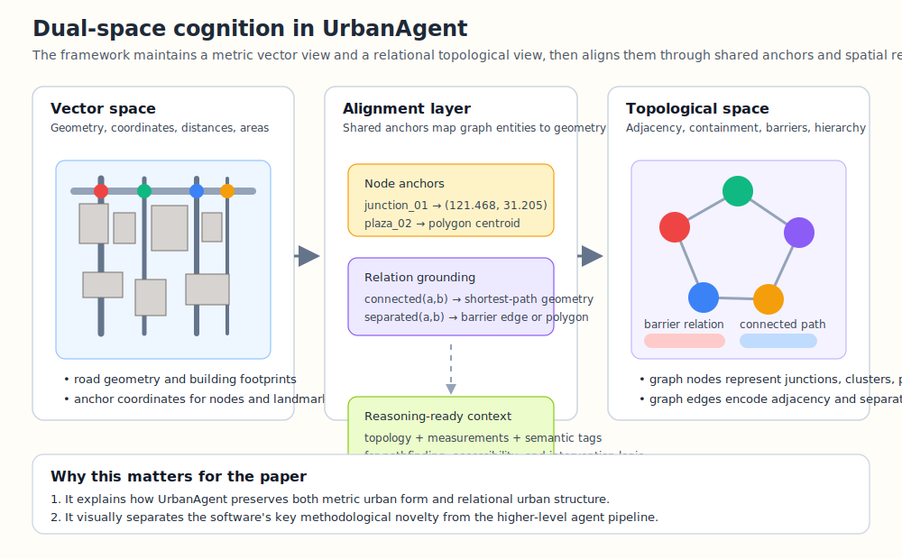
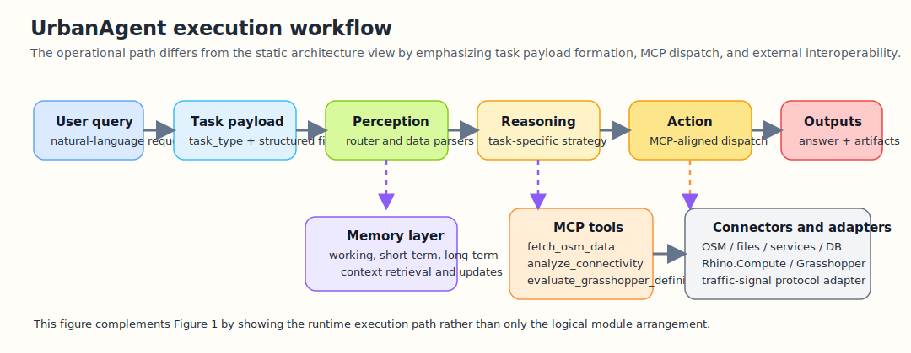
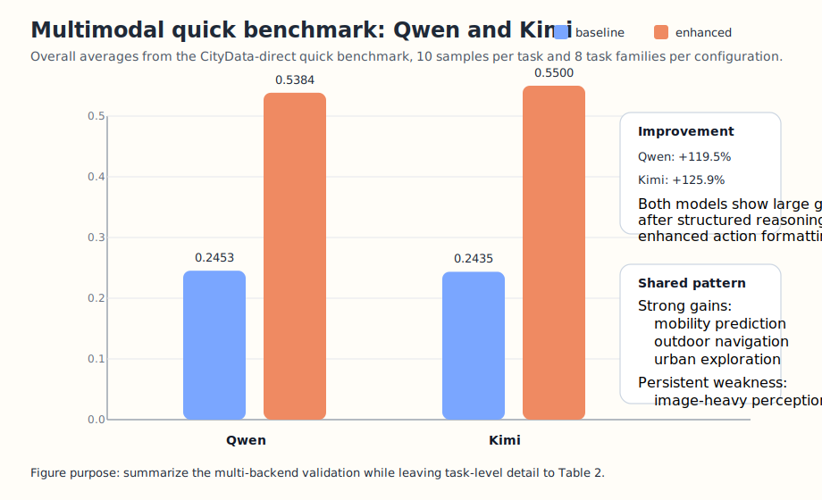

# UrbanAgent: An Open Framework for LLM-Orchestrated Urban Spatial Analysis

> **Target Journal**: Computers, Environment and Urban Systems (CEUS)
> **Special Issue**: Open Urban Data Science
> **Draft Version**: v0.2 — 2026-03-07

---

## Abstract

Urban data science increasingly relies on complex analytical workflows that integrate heterogeneous spatial data sources, diverse geospatial tools, and domain-specific reasoning. However, the steep learning curve of GIS software, the fragmented nature of urban data pipelines, and the difficulty of orchestrating multi-step spatial analyses remain significant barriers for researchers and practitioners. We present **UrbanAgent**, an open-source Python framework and research software package that leverages Large Language Models (LLMs) to orchestrate urban spatial analysis through a workflow-centric agent architecture. Rather than framing the system as a monolithic predictor, UrbanAgent organizes analysis into a recurrent loop of task grounding, multi-source perception, dual-space spatial cognition, task-specific reasoning, tool-mediated action, and feedback-driven refinement, while memory, MCP-based interoperability, and human checkpoints operate as cross-cutting services. At the implementation level, this analytical workflow is supported by a layered software stack with reusable capabilities, connectors, and semantic adapters for external systems and benchmark protocols, together with documentation, setup guides, a lightweight web interface, and reproducible validation scripts. In addition to the original GIS-oriented workflow, the revised software now includes connector abstractions for external systems, a benchmark adapter for traffic-signal tasks, and a CityData-direct evaluation pipeline that separates reusable benchmark assets from simulator-coupled code. We evaluate UrbanAgent through benchmark-embedded workflow validation and a verified quick benchmark across eight CityBench task types using two multimodal backends, Qwen and Kimi. In this benchmark, the enhanced agent configurations improve the average score from 0.245 to 0.538 for Qwen and from 0.244 to 0.550 for Kimi, with the largest gains appearing in mobility prediction, outdoor navigation, and urban exploration, while image-heavy tasks such as population prediction and object detection remain challenging. The same evaluation pipeline also exposes inspectable dual-space intermediate artifacts and guided/supervisory Human-AI checkpoints in representative tasks. These results position UrbanAgent not as a closed benchmark-specific system but as an extensible software package for open urban data science and interoperable urban software workflows.

**Keywords**: Urban data science; LLM agent; Spatial analysis; OpenStreetMap; Geospatial framework; Open-source software; Model Context Protocol

---

## 1. Introduction

Open urban data science now rests on a substantial foundation of open data and open software. Street networks, building footprints, imagery, and mobility traces are increasingly accessible through sources such as OpenStreetMap and related sensing platforms, while packages such as OSMnx, PySAL, and GeoPandas have made urban network analysis, spatial statistics, and geographic data engineering far more reproducible and extensible than in the proprietary-GIS era (Boeing, 2017; Rey & Anselin, 2007; Jordahl et al., 2020; Biljecki et al., 2021).

Yet urban spatial analysis remains difficult to execute end to end. Even routine tasks often require analysts to assemble heterogeneous data sources, graph models, metrics, visual outputs, and planning knowledge across multiple tools and formats. This integration burden has long been recognized in planning support systems and remains visible in recent discussions of planning-oriented AI adoption and urban modeling workflows (Pettit, 2005; Peng et al., 2024; Cai, 2025; Lartey & Law, 2025).

Recent Large Language Model (LLM) research suggests a way to reduce this burden. Reasoning-action loops, tool-use learning, API grounding, and multi-agent orchestration have made LLMs increasingly capable of coordinating external computation rather than only generating text (Yao et al., 2023; Schick et al., 2023; Patil et al., 2023; Wu et al., 2024; Hong et al., 2024; Wu et al., 2024b). In parallel, urban and geospatial studies have explored natural-language GIS interaction, urban-task benchmarking, geospatial code generation, and autonomous spatial workflows (Mansourian & Oucheikh, 2024; Zhang et al., 2024; Li et al., 2024; Feng et al., 2025; Hou et al., 2025; Lin et al., 2026). However, most existing systems remain narrowly task-bound, weak in explicit spatial reasoning, or tightly coupled to a single runtime, benchmark, or tool stack.

This paper argues that the missing piece is not another task-specific urban model, but an open workflow framework in which the LLM serves as an orchestrator over spatial data, spatial representations, and domain tools. Three gaps are especially salient. First, current urban and geospatial LLM systems rarely provide a general-purpose architecture that unifies perception, cognition, reasoning, memory, and action across multiple urban tasks. Second, they often rely on flattened textual or feature representations rather than explicit topological-metric structure, even though recent work shows that geometry, topology, and relational spatial understanding remain difficult for foundation models (Chen et al., 2024; Li et al., 2024b; Ji et al., 2025; Jiang & Wang, 2025). Third, they seldom integrate hierarchical memory and structured human oversight in a way that supports cumulative, location-aware urban analysis over time (Park et al., 2023; Zhong et al., 2025; Hu et al., 2025).

To address these gaps, we present **UrbanAgent**, an open-source Python framework for LLM-orchestrated urban spatial analysis. UrbanAgent treats the LLM as an intelligent coordinator of urban workflows rather than as a black-box predictor. Its core contribution is a workflow-centric analytical framework, supported by a layered software stack, that combines multi-source perception, dual-space spatial cognition, task-specific reasoning, hierarchical memory, protocol-based tool interoperability, and structured human checkpoints.

UrbanAgent makes four contributions. First, it formulates urban analysis as a recurrent workflow of task grounding, perception, cognition, reasoning, action, and refinement, rather than as a single-task benchmark pipeline. Second, it introduces a dual-space cognition model that explicitly aligns topological relations with vector geometry for interpretable spatial reasoning. Third, it integrates hierarchical spatio-temporal memory and six structured decision checkpoints to support cumulative human-AI collaboration. Fourth, it provides a reusable software implementation with modular documentation, connector setup guides, benchmark runbooks, a lightweight web interface, and a verified quick benchmark across eight CityBench task families and two multimodal backends.

The remainder of this paper is organized as follows. Section 2 presents a literature review on open urban data science software, LLM-agent foundations, geospatial LLM systems, spatial reasoning, and planning-oriented human-AI collaboration. Section 3 presents the UrbanAgent framework architecture. Section 4 details implementation, reproducibility assets, and open data integration. Section 5 presents benchmark evaluation together with representative workflow cases drawn from the same benchmark substrate. Section 6 discusses implications and limitations, and Section 7 concludes.

---

## 2. Literature Review

### 2.1 Open urban data science, multimodal sensing, and planning support

The foundation of contemporary urban data science is an ecosystem of open software and open spatial data. OSMnx supports automated acquisition and graph-theoretic analysis of street networks from OpenStreetMap (Boeing, 2017), PySAL offers mature spatial-statistical functionality for regionalization, autocorrelation, and inference (Rey & Anselin, 2007), and GeoPandas has become a standard layer for vector-data processing in Python workflows (Jordahl et al., 2020). More specialized packages, such as Madina and ZenSVI, extend this ecosystem toward pedestrian accessibility, planning-oriented network analysis, and street-view imagery acquisition and processing (Biljecki et al., 2024; Ito et al., 2025). Together, these tools have substantially lowered the barrier to reproducible urban analytics, but they still require analysts to manually assemble end-to-end workflows across multiple packages, data models, and interfaces.

At the data level, the literature increasingly emphasizes that no single urban modality is sufficient. Street-view imagery supports perceptual assessment of safety, greenery, enclosure, and visual quality, but its analytical value also depends on image quality control and measurement sensitivity across viewpoints and acquisition modes (Biljecki et al., 2021; Hou & Biljecki, 2022; Biljecki et al., 2023; Larkin et al., 2021). Remote sensing and overhead imagery provide regional-scale evidence on land cover, morphology, and density (Wang, 2024). Crowdsourced geospatial data has reshaped empirical urban science by supplying continuously updated representations of streets, land use, and points of interest (Huang et al., 2024). Trajectory and street-level sensing studies further connect spatial structure with observed movement and activity patterns (Zhang et al., 2019; Wang et al., 2021; Mazimpaka & Timpf, 2016). The challenge is therefore not only data availability, but data coordination across modalities that differ in scale, semantics, geometry, and update frequency.

This challenge has long been visible in planning support systems. Classic PSS research described planning analysis as an integration problem involving data pipelines, model composition, scenario comparison, and expert interpretation rather than isolated algorithmic tasks (Pettit, 2005). More recent work frames urban planning AI as an evolution from decision support toward broader plan-making assistance and interactive learning-based systems (Peng et al., 2024; Cai, 2025). Governance-oriented reviews likewise stress that planning applications require transparency, institutional memory, and human oversight rather than simple automation (Lartey & Law, 2025). UrbanAgent builds directly on this lineage: it assumes that urban analysis is a workflow problem and treats open urban software as interoperable components to be orchestrated rather than replaced.

### 2.2 LLM agents and tool-mediated analytical workflows

The recent LLM-agent literature provides the conceptual basis for workflow orchestration. ReAct showed that reasoning and acting can be interleaved within a single loop, making external action part of inference rather than a post-processing step (Yao et al., 2023). Toolformer and Gorilla demonstrated that explicit tool descriptions, schemas, and API grounding materially affect whether models can call tools reliably and at scale (Schick et al., 2023; Patil et al., 2023). AutoGen and MetaGPT extended this idea to role-specialized, staged, or collaborative multi-agent execution, where the system is organized around task decomposition, intermediate artifacts, and iterative coordination rather than one-pass prompting (Wu et al., 2024; Hong et al., 2024).

This body of work is especially relevant for urban analysis because urban tasks are rarely solved by a single model invocation. Data ingestion, cleaning, graph construction, metric calculation, scenario generation, visualization, and report writing often require different software components and different forms of intermediate representation. From this perspective, the important shift in LLM applications is not merely better natural-language interaction, but the emergence of models that can coordinate explicit computation. Recent work on tool-usage optimization and workflow design further suggests that performance depends not only on the base model, but on the structure of the surrounding action interface and the decomposition of tasks into reusable operations (Wu et al., 2024b; Patil et al., 2023; Schick et al., 2023).

However, general LLM-agent research still tends to abstract away domain structure. The tool is often treated as a generic API rather than a geospatial operator with topology, geometry, coordinate systems, uncertainty, and provenance. In urban analysis, this abstraction is too coarse. The literature therefore motivates protocol-based orchestration, but does not by itself provide a sufficient account of spatial data modeling, urban-domain semantics, or planning-oriented human review. These are precisely the aspects that a domain framework must supply.

### 2.3 Urban and geospatial LLM systems

Urban and geospatial LLM systems have expanded rapidly over the past two years, but they occupy different parts of the problem space. UrbanGPT treats urban regions as tokens for spatio-temporal prediction and demonstrates how LLM-style architectures can be aligned with traffic, flow, and crime forecasting tasks (Li et al., 2024). CityBench broadens the field by defining a benchmark suite over multiple urban tasks and modalities, making evaluation itself a first-class contribution (Feng et al., 2025). ChatGeoAI lowers the entry barrier for non-expert geospatial analysis through natural-language interaction, while GeoGPT moves further toward autonomous tool invocation for GIS operations (Mansourian & Oucheikh, 2024; Zhang et al., 2024).

Recent work has also diversified across geospatial-agent design choices. GeoCogent focuses on geospatial code generation and the evaluation of geographic programming capabilities (Hou et al., 2025). Evaluating Large Language Models on Geospatial Tasks extends the benchmarking conversation across a wider set of geospatial task families (Xu et al., 2025). Multi-agent Geospatial Copilots for Remote Sensing Workflows emphasizes orchestration in remote-sensing pipelines, while GeoJSON Agents explicitly compares function calling with code generation as alternative execution paradigms (Lee et al., 2025; Luo et al., 2026). GeoAgent, one of the closest systems to UrbanAgent in ambition, moves toward a hierarchical multi-agent architecture for autonomous spatial analysis, but is still centered more on spatial-analysis execution than on a broader workflow model that integrates urban semantics, multimodal perception, connector abstractions, and human checkpoints (Lin et al., 2026).

The emerging review literature reinforces this diversification. Surveys of urban computing in the LLM era describe the field as moving from predictive use cases toward richer assistant and decision-support roles (Li et al., 2025; Jiang et al., 2025). Smart-city agent frameworks similarly reposition LLMs as components in broader decision workflows rather than isolated predictors (Xu et al., 2025). Application-specific systems such as AutoBEE and CartoAgent illustrate the same trend in adjacent subdomains: one focuses on building-energy estimation, the other on cartographic styling, but both underscore how current systems remain tightly scoped around one task family or one workflow slice (Wang et al., 2024; Fu et al., 2024).

Taken together, this literature suggests that the field has solved neither openness nor compositionality. Existing systems variously contribute natural-language access, benchmarks, code generation, agent hierarchies, or workflow automation, but few provide a reusable urban-analysis framework that distinguishes reusable capabilities, external connectors, semantic adapters, and application-layer orchestration. That gap becomes more consequential as the literature grows more multimodal and more execution-oriented.

### 2.4 Spatial reasoning, scene understanding, and dual representations

Spatial reasoning is the point at which generic LLM-agent ideas most clearly encounter domain limits. In computer vision, scene-graph research established that explicit object-relation structure improves relational reasoning in complex scenes (Krishna et al., 2017; Yang et al., 2018). Recent vision-language work extends this trajectory by training or evaluating models on structured spatial reasoning, open-vocabulary scene graphs, and top-view spatial inference (Chen et al., 2024; Xu et al., 2025; Li et al., 2024b). SpatialGPT further shows that structured spatial memory can improve navigation-oriented reasoning, reinforcing the broader point that explicit relational organization matters when tasks require geometry-aware action planning rather than only description generation (Jiang & Wang, 2025).

The geospatial literature arrives at a similar conclusion from another direction. Foundation-model evaluation studies show that geometry, topology, containment, and topological relations remain difficult even for strong language and vision-language models (Ji et al., 2025). In other words, a model may appear capable on text-heavy geospatial tasks while still failing on the deeper structural reasoning that underlies urban morphology, navigation, accessibility, and connectivity analysis. This helps explain why purely text-mediated or code-generation-centric systems often remain brittle when asked to reason over urban form rather than merely call a tool.

Urban morphology and spatial cognition research provide a principled response to this limitation. Space syntax distinguishes topological structure from metric geometry, and cognitive-science work similarly suggests that people reason through both relational and metric views of space (Hillier & Hanson, 1984; Tversky, 2003). UrbanAgent adopts this insight explicitly: instead of flattening urban context into prompts or feature vectors, it aligns a topological graph with vector geometry so that reasoning can move bidirectionally between adjacency/containment structure and measurable distance/area/orientation. In the context of current literature, the dual-space model is therefore not only a design preference but a response to a clearly documented weakness of current foundation models.

### 2.5 Memory, collaboration, and planning-oriented oversight

Another recurring limitation in current systems is the absence of durable analytical continuity. Generative Agents demonstrated how memory and reflection enable coherent long-horizon behavior (Park et al., 2023). TiMem and HiAgent pushed this further by organizing memory across temporal scales and hierarchical working-memory regimes (Zhong et al., 2025; Hu et al., 2025). These advances matter for urban analysis because many tasks depend on accumulated local context, iterative hypothesis revision, and recall of earlier analytical decisions. Yet generic memory architectures typically index by time, task, or semantic similarity rather than by geography itself.

For urban and planning applications, this omission is substantial. Analysts often need to retrieve prior reasoning for the same neighborhood, compare new evidence with earlier observations, or preserve institutional knowledge about site conditions and intervention rationales. Planning support research has long treated such continuity as essential to expert decision-making, especially in collaborative or scenario-based settings (Pettit, 2005; Peng et al., 2024). Recent planning and governance literature also stresses accountability, interpretability, and human oversight when AI enters planning processes (Lartey & Law, 2025; Marasinghe et al., 2024). These concerns align closely with the need for explicit checkpoints and transparent intermediate representations.

UrbanAgent positions itself in this junction between agent memory and planning support. Its memory model is hierarchical and spatio-temporal, while its workflow exposes explicit review points rather than assuming that full autonomy is always desirable. This makes the framework closer to a planning-support and urban-analysis environment than to a purely autonomous execution agent.

### 2.6 Research gaps

The literature reviewed above reveals four persistent gaps that motivate UrbanAgent. First, most existing systems address only one slice of the workflow, such as prediction, benchmark execution, code generation, or natural-language GIS interaction, rather than providing a general-purpose framework that can coordinate heterogeneous urban-analysis tasks across data ingestion, reasoning, and action. Second, explicit spatial structure remains under-modeled: although recent work has improved spatial reasoning, many systems still rely on prompt-mediated descriptions or loosely structured features rather than aligned topological and metric representations. Third, interoperability is still fragmented. Existing geospatial agents often expose a fixed tool list or a single runtime paradigm, making it difficult to connect reusable urban-analysis components, external design platforms, and benchmark adapters within one coherent orchestration layer. Fourth, memory and human oversight are still weakly integrated. Prior agent-memory systems improve long-horizon continuity, and planning-support research emphasizes accountability and review, but few urban-agent systems combine spatio-temporal memory with explicit human checkpoints in a reusable framework.

UrbanAgent is positioned against these gaps rather than against any single prior paper. Table 1 therefore compares UrbanAgent with representative systems across six dimensions: whether the system is open and extensible, whether it supports multi-source spatial data, whether it uses explicit spatial structure reasoning, whether it includes memory, whether it offers standardized tool interfaces, and whether it supports structured human-AI collaboration.

**Table 1.** Comparison of UrbanAgent with existing urban LLM systems.

| System | Open Framework | Multi-Source Data | Spatial Structure Reasoning | Agent Memory | Standardized Tool Interface | Human-AI Collaboration |
|--------|:-:|:-:|:-:|:-:|:-:|:-:|
| UrbanGPT (Li et al., 2024) | ✗ | ✗ | ✗ | ✗ | ✗ | ✗ |
| CityBench (Feng et al., 2025) | △ | △ | ✗ | ✗ | ✗ | ✗ |
| ChatGeoAI (Mansourian & Oucheikh, 2024) | △ | △ | ✗ | ✗ | △ | ✗ |
| GeoGPT (Zhang et al., 2024) | △ | △ | ✗ | ✗ | △ | ✗ |
| GeoAgent (Lin et al., 2026) | △ | △ | ✗ | ✗ | △ | △ |
| AutoBEE (Wang et al., 2024) | ✗ | △ | ✗ | ✗ | ✗ | ✗ |
| Agentic Smart-City Framework (Xu et al., 2025) | △ | ✓ | ✗ | ✗ | △ | △ |
| **UrbanAgent (Ours)** | **✓** | **✓** | **✓** | **✓** | **✓** | **✓** |

*✓ = fully supported, △ = partially supported, ✗ = not supported*

---

## 3. The UrbanAgent Framework

### 3.1 Design Principles and Analytical Workflow

UrbanAgent is designed around three core principles:

1. **LLM as orchestrator, not predictor.** The LLM coordinates specialized geospatial tools and synthesizes their outputs, rather than attempting to predict urban phenomena directly from text. This principle aligns with a broader shift in LLM-agent research toward explicit reasoning-action loops, tool-use learning, API grounding, and role-based task decomposition rather than pure end-to-end generation (Yao et al., 2023; Schick et al., 2023; Patil et al., 2023; Wu et al., 2024; Hong et al., 2024; Wu et al., 2024b).

2. **Spatial structure as first-class representation.** Urban space is represented through dual topological-vector representations that capture both relational and metric properties, enabling the LLM to reason about spatial structure explicitly.

3. **Open orchestration over closed end-to-end automation.** UrbanAgent treats tools, data services, connectors, and benchmark protocols as interoperable components that can be recomposed for different urban tasks rather than as one fixed benchmark pipeline.

Recent agent papers increasingly describe their systems in terms of **workflow phases, agent roles, and iterative loops**, not only software layering. AutoGen and MetaGPT both frame multi-agent systems around explicit role division and staged execution (Wu et al., 2024; Hong et al., 2024). CityBench separates urban evaluation into data assets, tasks, and multimodal benchmark interactions (Feng et al., 2025). Planning-AI work similarly frames AI support as moving from decision support toward broader plan-making workflows rather than as isolated model inference (Peng et al., 2024; Lartey & Law, 2025). Following this literature pattern, UrbanAgent is better understood as a **workflow-centric analytical framework** with a supporting software stack, rather than as a paper whose main conceptual contribution is a five-layer software diagram.

Accordingly, we formulate UrbanAgent around **four analytical phases** plus **three cross-cutting mechanisms**.

**Phase I: task grounding and context construction.** A user query is translated into a structured analytical task specifying study area, target output, candidate data sources, and evaluation criteria. This phase is where UrbanAgent departs from benchmark-only systems: the same framework can begin from a natural-language planning question, a benchmark prompt, or a connector-delivered external task specification.

**Phase II: multi-source perception and structured urban representation.** The system then acquires or ingests heterogeneous urban data, converts them into typed urban objects, and assembles a unified spatial context. This phase covers not only data loading but also semantic normalization across maps, imagery, trajectories, and text.

**Phase III: dual-space cognition and task reasoning.** On top of the perceived spatial context, UrbanAgent constructs aligned topological and vector representations, derives spatial patterns, and performs task-specific inference or intervention generation. This is the core reasoning phase that distinguishes UrbanAgent from systems that operate on flat text, tabular prompts, or benchmark observations alone.

**Phase IV: tool-mediated action, output generation, and feedback.** The reasoning results are translated into concrete tool calls, connector invocations, benchmark actions, visual outputs, and report artifacts. Environmental feedback, tool responses, and human corrections are then fed back into the next analytical cycle.

Across these four phases, three mechanisms remain active throughout the workflow: **hierarchical spatio-temporal memory** for continuity, **MCP-based interoperability** for tool and connector access, and **human-in-the-loop checkpoints** for validation and override. This framing is closer to the way recent agent and urban-AI systems present their frameworks: the paper-level contribution is the task loop and division of functions, while the implementation stack explains how the loop is realized in software (Wu et al., 2024; Hong et al., 2024; Feng et al., 2025; Peng et al., 2024).

At the implementation level, this workflow is supported by a **five-layer software stack** shown in Figure 1: foundation execution, reusable geospatial capabilities, external connectors, semantic/protocol adapters, and application orchestration. We keep this layered description because it is important for extensibility and code organization, but in the paper narrative it should be read as the enabling infrastructure underneath the analytical workflow rather than as the framework itself.



**Figure 1.** Workflow-centric framework and supporting implementation stack of UrbanAgent. The analytical workflow proceeds through four phases—(I) task grounding and context construction, (II) multi-source perception and dual-space cognition, (III) task reasoning and decision, and (IV) tool-mediated action and output generation—while memory, MCP-based interoperability, and human checkpoints operate as cross-cutting services. The underlying software stack, from bottom to top, provides: foundation execution, reusable geospatial capabilities, external connectors, semantic/benchmark adapters, and application orchestration. Sections 3.2–3.4 detail each phase and the cross-cutting mechanisms.

### 3.2 Phases I–II: Perception and Dual-Space Cognition

The first analytical phase of UrbanAgent is to assemble a task-relevant urban context from heterogeneous inputs. Urban analysis requires processing diverse data modalities, each capturing different aspects of the urban environment. The selection of data types in UrbanAgent's perception stage is grounded in the complementary views that urban data science research has shown to be necessary for comprehensive spatial understanding. Street-network and building-footprint data from OpenStreetMap provide the morphological skeleton of urban form (Boeing, 2017). Remote sensing imagery supplies land-cover and density information at regional scale (Biljecki et al., 2021; Wang, 2024). Street-view imagery captures ground-level perceptual qualities such as aesthetics, safety, greenery, and enclosure that are difficult to recover from plan-view data alone, especially when the goal is to model human experience rather than only morphology; at the same time, recent methodology work stresses that such use depends on image quality and sensitivity to different viewpoints and collection strategies (Biljecki et al., 2021; Hou & Biljecki, 2022; Biljecki et al., 2023; Larkin et al., 2021; Wang, 2024). Trajectory data reveals actual human movement patterns that bridge spatial structure with urban activity, and recent surveys show that trajectory analytics has become a core substrate for mobility-aware urban AI (Wang et al., 2021; Mazimpaka & Timpf, 2016). The integration of these complementary modalities has increasingly been identified as necessary for holistic urban analysis and urban-LLM evaluation (Feng et al., 2025; Huang et al., 2024; Jiang et al., 2025). UrbanAgent therefore provides a unified interface for ingesting and structuring seven data types, with semantic adapters translating raw inputs into typed urban objects:

**OpenStreetMap (OSM) data.** The OSM processor uses `osmnx` to acquire road network graphs and building footprints within a specified bounding box or radius around a location. Raw OSM data is parsed into structured features comprising: road segments (with highway type, name, lane count), building footprints (with area, height, function), and points of interest (with category, name, coordinates). Road network topology is extracted as a NetworkX graph preserving intersection connectivity.

**Remote sensing imagery.** Satellite and aerial images are processed through a VLM (Vision-Language Model) integration that extracts land-use descriptions, density estimates, and feature classifications. The module supports both raw raster inputs (via `rasterio`) and pre-processed image files, transforming visual information into structured attributes (land_use categories, density levels, detected features).

**Street-view imagery.** Panoramic street-level photographs are analyzed through VLM-based scene understanding, generating six-dimensional perceptual scores (aesthetics, safety, vitality, walkability, greenery, enclosure) and spatial scene graphs describing element relationships. This enables ground-level perception of urban quality that complements the bird's-eye view from remote sensing, while remaining attentive to image-quality variation and viewpoint sensitivity highlighted in recent street-view methodology papers (Hou & Biljecki, 2022; Biljecki et al., 2023).

**Trajectory data.** Movement traces (GPS trajectories, check-in sequences) are processed to extract flow patterns, including origin-destination matrices, temporal distributions, and activity clustering. Trajectory features support mobility analysis and activity pattern recognition.

**GeoJSON and Shapefile data.** Vector datasets in standard formats are loaded and parsed to extract geometric features, spatial bounds, and area statistics. This provides interoperability with the broader GIS ecosystem.

**Text data.** Unstructured text descriptions (e.g., planning documents, observation notes) are processed through the LLM to extract spatial entities, locations, and urban attributes.

The Perception Module produces a unified `SpatialContext` data structure that encapsulates all extracted features regardless of data source, providing a consistent interface for downstream cognition. The `SpatialContext` contains: raw spatial features (geometries, attributes), bounding box and coordinate reference system, and metadata about data provenance and quality.

#### Dual-Space Spatial Cognition

The second analytical phase transforms perceived data into an explicitly reasoned urban representation. The Spatial Cognition Module is the core intellectual contribution of UrbanAgent, operating primarily through reusable geospatial capabilities with semantic grounding from the adapter layer. It implements a **dual-space representation** that simultaneously models urban space in two complementary domains:

- **Topological space**: A graph-based representation capturing spatial relationships—adjacency, connectivity, containment, alignment, and separation—between urban elements. Topological space answers questions like "what is connected to what" and "what contains what."

- **Vector space**: A coordinate-based representation capturing metric properties—distances, areas, shapes, and orientations—of urban elements. Vector space answers questions like "how far" and "how large."

This dual representation is inspired by the theory of space syntax (Hillier & Hanson, 1984), which distinguishes between the relational and metric properties of spatial configurations, and by cognitive science research showing that human spatial reasoning operates on both topological and metric representations simultaneously (Tversky, 2003). It is also consistent with recent work in VLM spatial reasoning and geospatial foundation-model assessment, which suggests that explicit relational structure remains important when models must reason over geometry, topology, and navigation-relevant context rather than only textual descriptions (Chen et al., 2024; Li et al., 2024b; Ji et al., 2025; Jiang & Wang, 2025).

#### Topological Graph Construction

The cognition module processes perceived features to construct a `TopologicalGraph` containing five types of nodes:

- **Junction nodes**: Road intersections with degree ≥ 3, representing decision points in the movement network.
- **Plaza nodes**: Open spaces identified through building clustering analysis, representing gathering and activity spaces.
- **Cluster nodes**: Building clusters detected via DBSCAN (eps=50m, min_samples=3), representing urban functional areas.
- **Landmark nodes**: Notable structures identified by name, height, or area prominence.
- **Barrier nodes**: Linear or areal features (rivers, railways, highways) that impede movement.

Five types of topological relations connect these nodes:

- **Adjacent**: Nodes within 100m direct distance.
- **Connected**: Nodes within 300m with path connectivity through the road network.
- **Contains**: Spatial containment relationships (e.g., a plaza within a building cluster).
- **Aligned**: Nodes sharing a linear morphological axis.
- **Separated**: Nodes divided by a barrier element.

#### Topological-Vector Alignment

A key operation is the alignment between topological and vector representations. Each topological node is anchored to a vector coordinate (`vector_anchor`), and each topological relation is mapped to a vector geometry (typically a `LineString` connecting anchor points). This alignment enables:

- **Spatial measurement of topological properties**: Computing metric distances and areas for topologically-defined relationships (e.g., the actual walking distance between two "connected" nodes).
- **Topological interpretation of vector patterns**: Identifying that a set of closely-spaced buildings forms a topological "cluster" or that a road network exhibits a grid vs. organic topology.

The alignment is computed by constructing a spatial index over node anchor points and mapping each topological relation to the shortest-path geometry in the road network.

Figure 2 illustrates this dual-space mechanism. The key point is not merely that UrbanAgent stores both graphs and geometries, but that it keeps them explicitly aligned so that urban reasoning can move back and forth between relational and metric views of the same place.



**Figure 2.** Dual-space cognition in UrbanAgent. Vector geometry preserves metric properties such as distance and area, topological space preserves adjacency and barrier relations, and the alignment layer grounds the two through shared anchors and relation-specific spatial mappings.

#### Semantic Annotation and Pattern Recognition

The constructed topological graph is enriched through two further processes:

**Semantic annotation** assigns functional meaning to topological structures:
- **Functional zoning**: Density-based classification (density > 0.7 → high-density residential; density < 0.3 with open space → park/recreation).
- **Path structure**: Classification of routes by connectivity degree into primary, secondary, and tertiary paths.
- **Activity centers**: Identification of nodes with high degree centrality and mixed-use POI presence.
- **Spatial quality**: Assessment of permeability (route options between points) and legibility (landmark visibility, wayfinding clarity).

**Pattern recognition** identifies higher-order urban morphological patterns:
- **Network structure**: Clustering coefficient, network density, and connected components via NetworkX graph analysis.
- **Hierarchy**: Stratification of network elements by connectivity degree into primary (top 20%), secondary (middle 30%), and tertiary (bottom 50%) levels.
- **Grain and orientation**: Analysis of building spacing regularity and street orientation distribution.
- **Urban fabric type**: Classification based on combined network and building cluster characteristics (grid, organic, radial, etc.).

### 3.3 Phase III: Reasoning, Memory, and Decision

The third analytical phase translates spatial cognition into task execution logic and decision outputs. Rather than using one generic prompting routine for all tasks, UrbanAgent maps different urban questions to different reasoning strategies. UrbanAgent currently supports eight categories of urban analysis tasks:

| Task Type | Reasoning Strategy | Key Inputs | Output |
|---|---|---|---|
| Population estimation | Density-based inference + LLM interpretation | Land use, building density, area | Numeric estimate |
| Object detection | VLM feature extraction + keyword matching | Remote sensing / street view images | Object list |
| Geolocation | Landmark matching + spatial cues | Scene images, text descriptions | City / coordinate |
| Geographic Q&A | Context-augmented LLM reasoning | Spatial context, domain knowledge | Natural language answer |
| Mobility prediction | Trajectory pattern analysis | Historical traces, land use | Next-location prediction |
| Traffic signal optimization | Flow-based computation | Road network structure, demand | Signal timing |
| Outdoor navigation | Network-based pathfinding + LLM instruction | Road graph, landmarks, destination | Route instructions |
| Urban exploration | POI diversity optimization | POI categories, spatial distribution | Exploration plan |

The reasoning module maintains a knowledge graph of spatial relations and urban elements that provides background knowledge for inference. For tasks requiring quantitative analysis, it delegates to the Decision Module.

**The Decision Module** implements a systematic design intervention workflow:

1. **Opportunity identification**: Analyzes the spatial cognition output to detect three types of improvement opportunities:
   - *Connectivity gaps*: Nodes with low connectivity degree or isolated components.
   - *Open space deficits*: High-density areas lacking accessible public space.
   - *Activity node potential*: High-centrality intersections underserving their connectivity potential.

2. **Proposal generation**: Creates up to five `InterventionProposal` objects, each specifying:
   - Topological target (which graph element to modify)
   - Vector geometry (`LineString` for connections, `Polygon` for spaces, `Point.buffer` for nodes)
   - Expected impact assessment
   - Spatial measurements

3. **Quantitative baseline and evaluation**: Four spatial measurement functions provide objective metrics:
   - `measure_connectivity()`: Global and local graph connectivity, maximum degree, isolated node count.
   - `measure_accessibility()`: Distance distribution from buildings to target facilities (mean, median, coverage radius).
   - `measure_density_distribution()`: Grid-based density analysis with hotspot detection and uniformity index.
   - `measure_walkability()`: Composite score from intersection density and POI density.
   - `measure_visual_integration()`: Visual exposure and enclosure assessment.

4. **Selection**: Proposals are ranked by relevance to the analysis task and expected metric improvement, with the top three selected for implementation.

#### Spatio-Temporal Memory

Complementing the reasoning and decision engine, a hierarchical memory system provides cross-cutting continuity across the entire analytical workflow. Urban analysis benefits from contextual continuity—knowledge accumulated from prior analyses of the same area or similar urban conditions. Recent agent-memory work increasingly points toward multi-tier organization and selective retrieval for long-horizon performance: Generative Agents used memory and reflection to sustain coherent agent behavior (Park et al., 2023), TiMem organized agent memory across temporal scales (Zhong et al., 2025), and HiAgent introduced hierarchical working-memory management for long-horizon tasks (Hu et al., 2025). In the urban domain, the spatial dimension adds a critical indexing axis: prior analyses of the same neighborhood should be retrievable by location, not only by recency or keyword. UrbanAgent therefore extends the temporal-hierarchical paradigm with explicit spatial indexing, implementing a three-tier memory architecture within the orchestration layer:

**Working memory** stores the current analytical context as key-value pairs—active task parameters, intermediate results, and tool outputs. It is cleared between tasks.

**Short-term memory** maintains a sliding window (capacity: 100 entries) of recent analytical experiences, supporting rapid retrieval through keyword-overlap matching (threshold: 30% term overlap). This enables the agent to reference recent findings during multi-step analyses.

**Long-term memory** provides persistent storage with three specialized indices:
- **Spatial index**: Memories indexed by geographic bounding box, enabling retrieval of prior analyses for the same or nearby locations.
- **Temporal index**: Time-stamped memories supporting queries like "what was the traffic pattern here last week."
- **Semantic index**: Type-tagged memories enabling retrieval by urban concept (e.g., all prior walkability assessments).

The memory retrieval process cascades from working memory (fastest, most relevant) through short-term (recent context) to long-term (historical knowledge), merging results across all three tiers.

### 3.4 Phase IV: Action, Collaboration, and Output

The fourth analytical phase materializes reasoning into executable actions, tool invocations, benchmark responses, and interoperable outputs. UrbanAgent employs the **Model Context Protocol (MCP)** to provide a standardized interface between the LLM orchestration layer and geospatial computation tools, connectors, and adapters. The choice of a protocol-based tool interface—rather than hard-coded function calls or purely prompt-level API retrieval—is motivated by three observations from prior work. First, tool-use studies such as Toolformer and Gorilla show that explicit tool schemas and API grounding materially affect the quality of model-tool interaction (Schick et al., 2023; Patil et al., 2023). Second, GeoGPT and recent geospatial-agent work show that LLMs can invoke spatial tools effectively, but also reveal the limits of fixed tool lists, single-runtime coupling, and code-generation-centric execution (Zhang et al., 2024; Hou et al., 2025; Lin et al., 2026). Third, newer urban and smart-city agent frameworks increasingly emphasize modular orchestration, task-specific role separation, and runtime composition of capabilities rather than one monolithic benchmark loop (Xu et al., 2025; Lee et al., 2025; Jiang et al., 2025). MCP addresses these limitations by defining a JSON-schema-based protocol where each tool specifies its name, description, parameter schema, and execution handler.

In the revised software architecture, MCP is not the lowest integration layer; instead, it exposes capabilities implemented by the connector layer (Layer 3) and the semantic adapter layer (Layer 4). Connectors are responsible for interoperating with external systems and widely used data ecosystems such as local GIS files, OpenStreetMap services, Web Feature/Map Services, databases, and parametric design platforms including Rhino.Compute / Grasshopper. Semantic adapters then translate connector outputs into urban-analysis-ready task objects. This design offers several advantages:

1. **Discoverability**: The LLM can query available tools and their capabilities at runtime.
2. **Composability**: Tools can be invoked in sequences determined by the LLM's reasoning, enabling dynamic workflow construction.
3. **Extensibility**: New tools can be registered through a single function call without modifying existing code.

UrbanAgent ships with a core set of built-in MCP tools for geospatial analysis and an expanding set of connector-facing tools for interoperability:

| Tool | Description | Key Parameters |
|---|---|---|
| `fetch_osm_data` | Acquire road/building/POI data from OSM | location, radius, data_types |
| `analyze_connectivity` | Graph-theoretic network connectivity analysis | road network GeoDataFrame |
| `measure_accessibility` | Distance-based accessibility measurement | buildings, targets, threshold |
| `calculate_density` | Grid-based spatial density computation | features, grid_size |
| `generate_svg_overlay` | Coordinate-accurate SVG map generation | features, interventions, bbox |
| `export_geojson` | GeoJSON FeatureCollection export | features, crs |
| `build_topology` | Topological graph construction from spatial features | spatial context |
| `evaluate_grasshopper_definition` | Execute Rhino/Grasshopper parametric definitions via Rhino.Compute | definition_path, input_values |
| `call_grasshopper_hops` | Invoke remote Grasshopper Hops workflows | endpoint, input_values |
| `invoke_rhino_compute` | Call arbitrary Rhino.Compute geometry endpoints | endpoint, arguments |

This distinction is important for urban software integration. Existing open urban data science tools such as OSMnx, GeoPandas, PySAL, Madina, and ZenSVI already provide mature computational primitives (Boeing, 2017; Jordahl et al., 2020; Rey & Anselin, 2007; Biljecki et al., 2024; Ito et al., 2025). UrbanAgent is designed to orchestrate these tools and connect them to external design environments rather than replace them with monolithic agent logic. The same principle applies to Rhino/Grasshopper integration: UrbanAgent does not reimplement parametric modeling kernels, but exposes them through connectors so that LLM reasoning can coordinate GIS analysis, simulation, and parametric design within one workflow.

Figure 3 complements the static architecture view by showing the runtime workflow. It highlights how a user query becomes a structured task payload, how MCP dispatch is inserted into the loop, and where connectors and adapters sit in actual execution.



**Figure 3.** Runtime execution workflow of UrbanAgent. The execution path proceeds from a user query to a structured task payload, then through perception, reasoning, and MCP-aligned action dispatch, while memory provides context and connectors or adapters expose both internal tools and interoperable external systems.

#### Human-AI Collaboration and Iterative Refinement

A central design principle of UrbanAgent is that the analytical loop should remain inspectable and revisable by domain experts. Urban spatial analysis involves value-laden judgments, domain-specific heuristics, and contextual knowledge that LLMs cannot reliably infer from data alone. We therefore embed **structured human-in-the-loop checkpoints** into the agent pipeline, enabling planners and researchers to guide, validate, and override AI-generated intermediate results at well-defined decision points.

We identify six critical decision points (DP) across the perception–cognition–reasoning–action pipeline where human expertise materially influences analytical quality:

**DP-1: Task Interpretation and Scoping.** After parsing the user's natural language query, the agent presents a structured task interpretation—including inferred task type, study area boundary, target metrics, and data sources to be invoked. The user confirms, refines the spatial scope, or adjusts the analytical objective before execution begins. This prevents misinterpretation of ambiguous intent (e.g., "walkability" could mean pedestrian infrastructure quality, perceived safety, or accessibility to amenities).

**DP-2: Data Source Validation.** The perception module proposes a data acquisition plan (which OSM layers, what imagery, which trajectory datasets). The user can add constraints (e.g., exclude certain POI categories, specify a temporal window for trajectory data, upload supplementary local datasets not available from open sources). This is particularly important when the analysis involves non-standard data or when data quality varies across sources.

**DP-3: Spatial Representation Review.** After the dual-space cognition module constructs the topological graph and vector alignment, the system visualizes the intermediate spatial representation—node types, relation types, cluster boundaries, barrier identification. The user reviews whether the machine-inferred spatial structure matches their domain understanding. For instance, a planner familiar with a neighborhood may recognize that a detected "barrier" is actually a permeable pedestrian underpass, or that two building clusters belong to the same functional zone despite their spatial separation.

**DP-4: Intervention Proposal Selection.** When the decision module generates candidate intervention proposals (e.g., new pedestrian connections, open space insertions, activity node enhancements), all proposals are presented with quantitative impact estimates. The user selects which proposals to carry forward, modifies geometries or parameters, or rejects proposals that conflict with planning constraints not encoded in the data (e.g., heritage protection zones, land ownership boundaries, ongoing construction projects).

**DP-5: Parameter Tuning.** Several analytical modules expose tunable parameters—DBSCAN clustering thresholds, walkability scoring weights, accessibility distance cutoffs, network hierarchy percentile boundaries. The agent provides default values derived from the urban morphology literature, but the user can adjust these based on local knowledge or research objectives. The system immediately re-computes affected outputs so the user sees the sensitivity of results to parameter choices.

**DP-6: Result Interpretation and Narrative.** After the pipeline produces quantitative outputs and spatial visualizations, the agent generates an interpretive summary. The user reviews whether the narrative correctly prioritizes findings, adds domain context (e.g., linking connectivity gaps to historical lane-fabric evolution), and approves or revises the final report before export.

**Interaction modes.** UrbanAgent supports three interaction modes that balance automation with human control:

- **Guided mode (default)**: The agent pauses at each decision point for user review. This mode is recommended for unfamiliar study areas, high-stakes planning contexts, or exploratory research where the user wants to understand each analytical step.

- **Supervisory mode**: The agent executes the full pipeline autonomously but produces a checkpoint report summarizing all intermediate decisions. The user reviews post hoc and can request re-execution from any checkpoint with modified parameters.

- **Autonomous mode**: The agent runs without interruption, producing a final report. This mode is appropriate for batch processing or when the pipeline has been validated on similar tasks and the user trusts the default configuration.

**Feedback-driven refinement.** Human interventions are not merely one-shot corrections. UrbanAgent's memory module records user overrides as contextualized preferences: if a user consistently rejects barrier classifications for pedestrian underpasses in a particular city, this preference is stored in long-term spatial memory and applied to future analyses in the same area. Over time, the system adapts its default behavior to reflect accumulated human domain knowledge, creating a collaborative learning loop between the analyst and the agent.

Figure 7 illustrates the human-in-the-loop workflow, showing where each decision point sits within the agent pipeline and how human feedback flows back into the memory system.


**Figure 7.** Human-AI collaborative interaction design in UrbanAgent. Six decision points (DP-1 through DP-6) are embedded across the perception–cognition–reasoning–action pipeline. At each checkpoint, the agent presents structured intermediate results for human review, and user overrides are recorded in the memory system for future adaptation.

#### Visualization and Deliverables

The final outputs of the workflow must be usable by both machines and human analysts. UrbanAgent therefore provides two visualization outputs that bridge analytical results and geographic context:

**SVG overlay generation** produces scalable vector graphics where:
- Geographic coordinates are precisely mapped to SVG coordinates through affine transformation with Y-axis inversion.
- Three rendering layers are composited: base map (building footprints as filled polygons, road segments as styled paths), intervention overlay (color-coded by type: green for connectivity, blue for open space, orange for activity nodes), and legend layer.
- The output is a self-contained SVG document that can be embedded in reports or web applications.

**GeoJSON export** produces standard FeatureCollection documents compatible with any GIS tool, web mapping library, or geographic database. Each intervention proposal is serialized as a Feature with geometry and properties (type, description, measurements, expected impact).

**Measurement reports** are generated as structured documents combining quantitative metrics (connectivity indices, accessibility statistics, density distributions) with interpretive text, providing both machine-readable and human-readable outputs.

---

## 4. Implementation and Open Data Integration

### 4.1 Software Architecture

UrbanAgent is implemented in Python 3.9+ and realizes the workflow-centric framework of Section 3 through a five-layer supporting software stack with clear separation of concerns. The current codebase revision was motivated by two engineering goals: first, to reduce coupling between benchmark logic (adapter layer) and the reusable software framework (foundation, capabilities, and connectors); second, to make external urban software systems accessible through the same agent-facing interface as native Python geospatial tools. The updated codebase organization maps directly to this supporting stack:

```
urban_agent/
├── __init__.py              # Package entry point
├── core.py                  # Main UrbanAgent orchestrator
├── cognition.py             # Dual-space spatial cognition (585 lines)
├── decision.py              # Spatial decision engine (521 lines)
├── visualization.py         # SVG/GeoJSON visualization
├── mcp_tools.py             # MCP tool registry and execution
├── connectors/              # External system connectors (Rhino.Compute, APIs, files)
│   ├── base.py              # Connector abstraction
│   ├── registry.py          # Connector registry
│   └── rhino_connector.py   # Rhino.Compute and Grasshopper connector
├── adapters/                # Semantic and benchmark adapters
│   └── traffic_signal_adapter.py # Simulator-to-agent traffic adapter
├── perception/
│   ├── osm_processor.py     # OpenStreetMap data processing
│   ├── remote_sensing.py    # Satellite imagery processing
│   └── street_view.py       # Street-view image analysis
├── core/
│   ├── agent.py             # Async agent execution engine
│   ├── perception.py        # Multi-source perception router
│   ├── reasoning.py         # Task-specific reasoning strategies
│   ├── action.py            # Action execution with tool calling
│   └── memory.py            # Hierarchical memory management
├── llm/
│   ├── qwen_client.py       # Qwen (text + vision) client
│   ├── deepseek_client.py   # DeepSeek (chat + reasoner) client
│   └── kimi_client.py       # Kimi (text + vision) client
├── tools/
│   └── geo_tools.py         # GeoDataLoader + SpatialAnalyzer
└── evaluation/
    ├── citybench_evaluator.py    # Evaluation framework v1
    └── citybench_evaluator_v2.py # Multi-dimensional evaluator
```

  The core dependencies are: `osmnx` for OSM data acquisition and network analysis, `networkx` for graph analysis, `geopandas` and `shapely` for geospatial data processing, `scikit-learn` for spatial clustering (DBSCAN), and standard HTTP clients for LLM API communication. Optional dependencies include `rasterio` for raster data, `PIL` for image processing, and connector-side services such as Rhino.Compute for interoperable parametric geometry evaluation.

  Relative to the earlier draft, the software has been strengthened in four specific ways. First, task-type propagation was unified in the async execution path so that perception, reasoning, and action consistently receive the same structured task payload. Second, the reasoning module was extended from generic prompting to task-specific structured reasoning over CityData fields such as answer choices, mobility histories, traffic phase options, navigation steps, and exploration candidates. Third, the action layer was aligned around the MCP runtime so that both built-in geospatial functions and connector-facing capabilities are exposed through one invocation interface. Fourth, the benchmark pipeline was refactored into a CityData-direct quick evaluator, allowing data- and prompt-centric tasks to run without inheriting unnecessary benchmark runtime code, while retaining a benchmark adapter for tasks such as traffic signal control that remain coupled to simulator semantics.

### 4.2 LLM Backend Support

UrbanAgent abstracts LLM communication through a unified client interface that supports multiple backends:

- **Qwen** (Alibaba): Supports both text and vision (VLM) modes via `qwen-vl-plus` and `qwen3-vl` models. Used for tasks requiring image understanding (remote sensing, street view).
- **DeepSeek**: Supports chat (`deepseek-chat`) and deep reasoning (`deepseek-reasoner`) modes. Text-only, offering analytical reasoning for non-vision tasks.
- **Kimi** (Moonshot): Supports text and vision via `kimi-k2.5` model. Provides balanced text and image understanding.

Each client handles API-specific authentication, request formatting, retry logic, and response parsing. The client interface exposes a single `async generate(prompt, images=None)` method, allowing the agent core to be backend-agnostic. At the time of writing, both Qwen and Kimi have been exercised in the revised quick-benchmark pipeline and are included in the verified aggregate results reported below.

### 4.3 Open Data Integration

UrbanAgent is designed to work exclusively with open data sources, ensuring reproducibility and accessibility:

- **OpenStreetMap**: The primary spatial data source, providing globally consistent road network, building footprint, land use, and POI data through the `osmnx` interface.
- **Remote sensing datasets**: Compatible with open satellite imagery (e.g., Sentinel-2, Landsat) and benchmark datasets.
- **Street-view imagery**: Supports processing of publicly available panoramic imagery.
- **Trajectory data**: Processes standard GPS trace formats and check-in datasets.

The `CityBenchDataLoader` class provides structured access to city-specific datasets for nine world cities (Beijing, London, Paris, Tokyo, New York, Mumbai, Sydney, Moscow, Shanghai), supporting reproducible cross-city analysis. In the revised benchmark workflow, these data assets are also used directly by a lightweight evaluator so that tasks such as GeoQA, geolocation, mobility prediction, outdoor navigation, and urban exploration can be assessed as reusable data-plus-protocol problems rather than as tightly coupled benchmark executables.

### 4.4 Extensibility

UrbanAgent is designed for extension along three axes:

**New data sources** can be added by implementing a perception processor that converts raw data into the `SpatialContext` structure.

**New analysis tools** can be registered with the MCP tool layer through a single function call:
```python
mcp_tools.register_tool(
    name="analyze_green_coverage",
    description="Calculate urban green space coverage ratio",
    parameters={"features": "GeoDataFrame of vegetation polygons", "area": "Study area in sq meters"},
    handler=green_coverage_handler
)
```

**New LLM backends** can be integrated by implementing the client interface with `generate()` and optional `generate_with_vision()` methods.

### 4.5 Software Packaging and Reproducibility Assets

Because this special issue is centered on software contributions, UrbanAgent is organized not only as an algorithmic prototype but as a reusable research software package. The repository already includes package-level and module-level documentation, a lightweight browser-based interface, connector setup guides, benchmark runbooks, quick-start scripts, and saved validation artifacts. In practical terms, these materials expose how the software is installed, how benchmark tasks are executed, how external systems such as Rhino / Grasshopper are connected, and how intermediate outputs can be inspected and exported.

The package also contains reproducibility-oriented assets that matter for a software paper: a CityData-direct quick-benchmark runner, task logs, serialized output artifacts, environment and connector validation scripts, and benchmark-facing result summaries. These components allow the same codebase to function simultaneously as an interactive analysis tool, a benchmark runner, and a regression suite for ongoing development.

At the same time, UrbanAgent should not yet be overstated as a fully mature community platform. Before archival release, the project still needs a finalized liberal open-source license at the project root, versioned public releases, broader automated test coverage, and explicit issue-tracking conventions. We state this boundary explicitly because the contribution of UrbanAgent lies in making a reusable urban-analysis software stack inspectable and extensible, not in claiming community adoption that has not yet been demonstrated.

---

## 5. Benchmark Evaluation and Representative Workflow Cases

Earlier drafts separated narrative case studies from benchmark evaluation. For a software paper, that split is less useful than evaluating the same package through one coherent evidence chain. We therefore merge the former Sections 5 and 6 into a single experimental section: the empirical question is not whether UrbanAgent can produce an attractive one-off demonstration, but whether the released software package can (1) solve representative urban tasks, (2) expose interpretable process traces, and (3) remain controllable under Human-AI supervision.

### 5.1 Experimental Setup

To evaluate the current software revision on standardized urban tasks, we employ a **CityData-direct quick benchmark** derived from CityBench (Feng et al., 2025). This evaluator preserves the eight task families and CityBench data assets, but runs them through UrbanAgent's unified task interface rather than through the full original benchmark runtime whenever direct reuse is feasible. This distinction is important: several CityBench tasks are primarily data-and-prompt problems and can therefore be reused as framework-level benchmark assets, whereas traffic signal control still requires an adapter because it depends on simulator-specific state semantics.

**Task types**: Population prediction (PP), object detection (OD), geolocation (GL), geographic Q&A (GQ), mobility prediction (MP), traffic signal optimization (TS), outdoor navigation (ON), and urban exploration (UE).

**Models reported in this draft revision**: Qwen (qwen-vl-plus / qwen3-vl family) and Kimi (kimi-k2.5), both used as text-plus-vision backends for the verified quick benchmark.

**Configurations**: The same backend is evaluated in two modes:
- **Baseline agent path**: the unified execution pipeline is used with generic reasoning and minimal task-specific adaptation.
- **Enhanced agent path**: the revised UrbanAgent pipeline uses structured task payloads, task-specific reasoning routines, MCP-aligned action execution, and benchmark adapters where needed.

**Metric**: For the current quick benchmark, we report the task-outcome score used by the CityData-direct evaluator. Each task type is sampled with 10 instances, yielding 80 evaluations per configuration. Traffic signal control is currently evaluated in proxy mode through the traffic-signal adapter unless full CitySim state is wired into the runtime.

To replace the previously detached Tianzifang demonstration with benchmark-native evidence, we also ran a **targeted representative-case subset** after the latest API cleanup. On 2026-03-09, the enhanced Qwen configuration was rerun on four task families that make process visibility especially clear: mobility prediction, traffic signal control, outdoor navigation, and urban exploration. We sampled two instances per task family and used this targeted rerun only for workflow inspection, not for replacing the larger quantitative benchmark.

This combined design supports three complementary claims about the software package:

1. **Task usefulness**: the package can complete representative urban tasks with measurable outcome quality.
2. **Intermediate interpretability**: the package emits inspectable task payloads, reasoning chains, action objects, and benchmark-facing traces instead of only final answers.
3. **Human controllability**: the same task loop can run in guided, supervisory, or autonomous mode, with explicit checkpoints for confirmation, correction, and override.

### 5.2 Overall Results

Table 2 presents the verified quick-benchmark results across all eight task types.

**Table 2.** Average scores across eight CityData-direct task types in the current quick benchmark. Best score per column in **bold**.

| Configuration | PP | OD | GL | GQ | MP | TS | ON | UE | **Avg** |
|---|---|---|---|---|---|---|---|---|---|
| Qwen baseline | 0.0626 | 0.0000 | 0.8000 | 0.1000 | 0.0000 | 1.0000 | 0.0000 | 0.0000 | 0.2453 |
| Qwen enhanced | 0.0000 | 0.0069 | 0.8000 | 0.1000 | 0.4000 | 1.0000 | 1.0000 | 1.0000 | 0.5384 |
| Kimi baseline | 0.0479 | 0.0000 | 0.6000 | 0.1000 | 0.2000 | 1.0000 | 0.0000 | 0.0000 | 0.2435 |
| Kimi enhanced | 0.0000 | 0.0000 | 0.7000 | 0.3000 | 0.4000 | 1.0000 | 1.0000 | 1.0000 | **0.5500** |

*PP=Population Prediction, OD=Object Detection, GL=Geolocation, GQ=Geographic Q&A, MP=Mobility Prediction, TS=Traffic Signal, ON=Outdoor Navigation, UE=Urban Exploration.*

Both multimodal backends show large gains after the software revision. The overall average increases from 0.2453 to 0.5384 for Qwen and from 0.2435 to 0.5500 for Kimi.

**Table 3.** Relative improvement of the enhanced configurations over the corresponding baseline quick-benchmark configurations.

| Configuration Pair | Improvement |
|---|---|
| Qwen enhanced vs. Qwen baseline | +119.5% |
| Kimi enhanced vs. Kimi baseline | +125.9% |

Figure 4 summarizes the overall multi-backend benchmark result and shows that the same engineering changes improve both multimodal backends.



**Figure 4.** Overall quick-benchmark comparison for Qwen and Kimi. Both backends improve substantially under the enhanced UrbanAgent pipeline, indicating that the software revision generalizes beyond a single multimodal model while preserving the same qualitative gain pattern.

### 5.3 Representative Workflow Cases from the Benchmark

The purpose of the targeted rerun is to replace a disconnected standalone case study with benchmark-native process evidence. Instead of moving outside the evaluation suite, we inspect representative tasks drawn from the same benchmark substrate and show how the released software exposes its intermediate workflow.

**Case 1: Mobility prediction (Tokyo).** In one rerun instance, the agent received a trajectory-history payload centered on a Saturday morning target stay in Tokyo, with ground-truth destination ID 36153. The enhanced pipeline kept the input as a structured sequence of historical stays and context stays, then emitted an explicit reasoning chain ("Analyzing historical trajectory patterns", "Identifying movement trends", "Predicting future mobility flows") before producing `predicted_location = 36153`. The importance of this case is not only correctness, but inspectability: the benchmark trace preserves the temporal evidence, the predicted destination, and the action object that a user could verify or override.

**Case 2: Traffic signal control (CapeTown proxy task).** In a representative proxy-control instance, the benchmark exposed phase options and queue lengths directly to the agent: north-south = 10, east-west = 6, left-turn = 7, pedestrian scramble = 5. UrbanAgent selected option C, corresponding to the north-south phase, and proposed a 55 s green interval with 5 s yellow and 55 s red. This case is useful because it shows benchmark-aligned controllability: the user can inspect candidate phases, compare queue summaries, and decide whether to accept or modify the action before deployment.

**Case 3: Outdoor navigation (Beijing).** A second rerun instance required the agent to reproduce a four-step route sequence in Beijing. The benchmark payload contained stepwise observations and the target action chain `forward-left-forward-stop`. UrbanAgent converted this into a route description and an explicit `route_actions` list that matched the benchmark ground truth exactly. This task demonstrates how the package surfaces route logic in a reviewable form instead of only returning a free-form answer.

**Case 4: Urban exploration (Paris).** In the Paris exploration rerun, the agent had to choose among three candidate destinations starting from Rue Jules Auffret nearby. All candidates achieved full completion, so the decision depended on route efficiency: UrbanAgent selected option A, Rue Méhul nearby, over alternatives that required more steps. The resulting exploration plan preserved both the selected destination and the action object (`selected_option`, `selected_destination`) used by the evaluator. This is the kind of benchmark-internal case that better supports a software paper than a detached narrative site demonstration.

Across these rerun cases, the enhanced Qwen configuration achieved an average score of 1.000 on the four-task representative subset (two instances per task family). This subset is too small to replace the main benchmark table, but it provides the detailed workflow traces needed for process-oriented evaluation without leaving the benchmark setting.

### 5.4 Interpretation

Several findings emerge from the current benchmark revision:

**Finding 1: Structured task handling materially improves the framework-level benchmark for both multimodal backends.** The enhanced configurations raise the average score from 0.2453 to 0.5384 for Qwen and from 0.2435 to 0.5500 for Kimi, indicating that the recent software changes are not merely architectural cleanup but translate into measurable task gains.

**Finding 2: The largest gains come from tasks that benefit from explicit structure rather than raw image description.** For both Qwen and Kimi, mobility prediction improves to 0.4000, while outdoor navigation and urban exploration rise from 0.0000 to 1.0000. These are precisely the tasks where structured histories, route summaries, candidate ranking, and task-specific action formatting matter most.

**Finding 3: The benchmark now also validates interpretability and control within the same task loop.** The targeted rerun shows that mobility, navigation, exploration, and traffic-related tasks all preserve inspectable task payloads, candidate actions, and explicit action objects, so the framework can be audited during execution rather than only after scoring. This is a software property, not just an evaluation side note.

**Finding 4: Kimi and Qwen show similar gain structure but slightly different strengths.** Qwen remains stronger in geolocation in the current quick benchmark (0.8000 vs. 0.7000 in the enhanced setting), whereas Kimi improves more clearly on GeoQA (0.3000 vs. 0.1000). This suggests that the software layer can help multiple models while still exposing model-specific strengths and weaknesses.

**Finding 5: Vision-heavy tasks remain the main weakness.** Population prediction collapses to 0.0000 in both enhanced settings, while object detection remains near zero for both models. The current software revision therefore improves reasoning and action alignment much more than it improves urban visual perception. Better multimodal prompting, specialized vision tools, or domain-tuned perception modules will be needed here.

**Finding 6: The quick benchmark is diagnostic, not yet final.** Traffic signal control saturates in the current proxy evaluation, and several task families still depend on simplified scoring assumptions. The present benchmark should therefore be interpreted as a reproducible development-stage validation rather than a definitive leaderboard result.

**Finding 7: Decoupling benchmark assets from benchmark runtime is useful in itself.** The CityData-direct evaluator shows that a meaningful portion of CityBench can be reused as a software-facing benchmark asset rather than only as a monolithic benchmark executable. This is important for open urban software research because it allows benchmark tasks to serve simultaneously as evaluation cases and as reusable regression tests for framework development.

---

## 6. Discussion

### 6.1 UrbanAgent as Open Urban Research Software

UrbanAgent is positioned within the emerging ecosystem of open urban data science tools—alongside OSMnx, GeoPandas, PySAL, Madina, ZenSVI, and the broader literature on multimodal urban sensing—but addresses a different tier of the analytical stack. While existing tools provide specialized geospatial computation or modality-specific measurement, UrbanAgent provides the *orchestration layer* that composes these tools into coherent analytical workflows (Boeing, 2017; Rey & Anselin, 2007; Jordahl et al., 2020; Biljecki et al., 2024; Ito et al., 2025; Wang, 2024). The recent connector-and-adapter refactor sharpens this positioning further: the framework is no longer described as a benchmark wrapper with auxiliary tools, but as a general orchestration substrate capable of coordinating native Python geospatial libraries, benchmark adapters, and external systems such as Rhino.Compute / Grasshopper through a common agent-facing interface. This positioning is consistent with recent reviews of urban computing in the LLM era and newer geospatial-agent architectures that frame LLMs as orchestration middleware rather than as standalone spatial predictors (Li et al., 2025; Lin et al., 2026; Luo et al., 2026).

What matters for this special issue is therefore not only conceptual novelty, but packaging. UrbanAgent's contribution depends on whether another group can inspect the repository, follow setup guides, run benchmark scripts, connect external tools, review intermediate artifacts, and adapt the package to new tasks. In that sense, runbooks, connector documentation, benchmark scripts, saved artifacts, and interface layers are part of the research contribution rather than peripheral implementation detail. At the same time, the software-paper framing also makes current gaps more visible: public release engineering, licensing, and broader external adoption are now first-order evaluation criteria rather than secondary housekeeping issues.

The dual-space spatial cognition model represents a novel bridge between traditional urban morphological analysis (space syntax, network analysis) and LLM-based reasoning. By structuring spatial information as topological graphs with vector anchoring, we provide LLMs with representations that preserve the structural properties of urban form—properties that are often diluted when spatial data is flattened into text descriptions or loosely serialized features. Recent work on spatial VLMs, top-view spatial reasoning, and geospatial foundation-model evaluation reinforces the value of explicit relational structure for tasks involving geometry, topology, and navigation (Chen et al., 2024; Li et al., 2024b; Ji et al., 2025; Jiang & Wang, 2025).

### 6.2 Human-AI Collaboration in Urban Spatial Analysis

The human-in-the-loop design described in Section 3.4 reflects a broader argument: effective LLM-based urban analysis is neither fully autonomous nor merely tool-assisted, but *collaborative*. This argument is compatible with both classic planning support systems and recent planning-AI literature, which emphasize that computational systems are most useful when they amplify expert judgment rather than displace it (Pettit, 2005; Peng et al., 2024; Lartey & Law, 2025; Marasinghe et al., 2024).

**Who holds authority at each stage.** Our six-checkpoint design assigns cognitive labor according to comparative advantage. The LLM excels at data integration, pattern detection, and combinatorial exploration (e.g., generating multiple intervention proposals quickly), while the human analyst contributes contextual judgment, value alignment, and accountability. DP-3 (spatial representation review) is especially critical: topological misclassification—such as treating a pedestrian underpass as a barrier—propagates errors through every downstream module. Only a domain-knowledgeable human can catch such errors reliably at present.

**Granularity of control matters.** The three interaction modes (guided, supervisory, autonomous) are designed for different trust levels. Early-stage research or unfamiliar study areas warrant guided mode, where the analyst builds intuition about the system's spatial reasoning. Once the pipeline has been validated for a city or task type, supervisory or autonomous mode accelerates throughput without sacrificing auditability. This graduated trust model parallels established paradigms in autonomous vehicle levels and human-robot teaming.

**Accumulated feedback as institutional knowledge.** When the memory module records user overrides, it effectively captures institutional knowledge that is otherwise tacit. If a planning office consistently adjusts accessibility thresholds for their local context, these preferences become part of the system's long-term memory—transferable to new staff members or collaborating teams. This creates a form of organizational learning that is rare in current GIS workflows.

**Transparency and explainability.** Each decision point is accompanied by a structured summary of what the agent decided and why, making the AI reasoning auditable. This is important for planning contexts subject to public scrutiny or regulatory review, where black-box recommendations are unacceptable.

### 6.3 Interactive Web Interface for Accessible Urban Analysis

To operationalize the human-AI collaborative model, we develop a lightweight web-based interface that serves as the primary interaction surface for UrbanAgent. The interface is designed around three principles:

1. **Low barrier to entry.** The interface requires no GIS software installation and runs in any modern browser, making urban spatial analysis accessible to interdisciplinary researchers, planners, community stakeholders, and students.

2. **Spatial-first interaction.** An interactive map (Leaflet/MapLibre) is the central canvas. Users define study areas by drawing on the map, inspect spatial representations by clicking features, and review intervention proposals through direct spatial manipulation.

3. **Pipeline transparency.** A step-by-step pipeline panel shows the current stage of analysis, intermediate outputs at each decision point, and enables human intervention through review/approve/modify controls corresponding to DP-1 through DP-6.

The interface consists of four panels: (a) a conversational input panel where users express analytical intent in natural language; (b) a map visualization panel that displays base layers, topological graph overlays, and intervention proposals in real time; (c) a pipeline progress panel that tracks the agent's execution state and presents checkpoints for human review; and (d) a results panel that aggregates metrics, visualizations, and exportable reports. Real-time communication between the browser and the UrbanAgent backend is maintained through WebSocket connections, enabling progressive disclosure of results as the agent pipeline executes.

This interface is implemented as a self-contained web application (FastAPI + static HTML/CSS/JS) that can be deployed locally or on shared infrastructure, making it straightforward to transfer across institutions or embed into existing urban analytics platforms.

### 6.4 Implications for Urban Research Practice

UrbanAgent lowers the barrier to conducting multi-step urban spatial analysis. A researcher who would previously need to write code integrating osmnx, geopandas, networkx, and matplotlib can now express their analytical intent in natural language and receive structured spatial analysis outputs. This democratization objective aligns with recent work on planning AI, geospatial decision support, and public-facing natural-language GIS systems, all of which argue that accessibility and inspectability are central if AI is to be useful in real urban workflows (Mansourian & Oucheikh, 2024; Peng et al., 2024; Lartey & Law, 2025; Marasinghe et al., 2024). This democratization has particular value for:

- **Interdisciplinary researchers** (e.g., public health, sociology) who study urban phenomena but lack GIS programming skills.
- **Rapid urban assessment** scenarios where quick spatial analysis of unfamiliar areas is needed.
- **Teaching and training** in urban data science, where the agent can demonstrate analytical workflows step by step.
- **Participatory planning** scenarios where community stakeholders interact with the agent through the web interface to explore design alternatives, with the human-AI checkpoints ensuring that local knowledge is incorporated into spatial analysis.

### 6.5 Limitations and Future Work

Several limitations should be acknowledged:

**Research-software maturity and adoption.** The current package already includes modular source code, setup guides, benchmark scripts, a web demo, and saved validation artifacts, but it does not yet demonstrate the full maturity expected of widely adopted urban research software. Before final archival release, the project should expose a root-level liberal open-source license, versioned public releases, broader automated tests, public issue tracking, and clearer evidence of external uptake.

**LLM reasoning accuracy.** The agent's analytical quality is bounded by the underlying LLM's capabilities. Population prediction and mobility forecasting remain challenging because they require quantitative modeling beyond current LLM reasoning.

**Tool and connector coverage.** The current MCP tool set covers fundamental spatial analysis operations and now supports an initial connector interface for external parametric design platforms. However, specialized tools for advanced analyses (e.g., spatial regression, land-use change detection, 3D morphology) and more production-hardened connectors for GIS servers, simulation engines, and CAD platforms remain future work. The Rhino/Grasshopper path is now operational at the connector level, but still depends on a running Rhino.Compute or Hops service and has not yet been demonstrated in a full end-to-end urban design case study.

**Real-time data.** UrbanAgent currently processes static data snapshots. Integration with real-time urban data streams (traffic sensors, transit feeds, social media) would enable temporal analysis.

**Evaluation completeness.** The CityBench-derived quick benchmark reported here is intentionally lightweight and should be interpreted as a development-stage validation rather than a final benchmark paper result. It verifies that recent software changes improve several task families, but a fuller study should include additional backends, larger sample counts, and direct comparison against the original CityBench runtime wherever feasible.

**Scalability.** Processing very large urban areas (city-wide analysis) may exceed LLM context windows and tool processing capacity. Hierarchical decomposition strategies are needed for scale.

Future work will focus on: (1) expanding the MCP tool library with specialized urban analysis tools (space syntax, urban climate, transport modeling); (2) broadening the connector layer to additional GIS servers, databases, and design platforms; (3) implementing multi-agent collaborative analysis where specialized agents handle sub-tasks; (4) integrating real-time urban data sources; (5) extending the human-AI collaborative model to multi-user and multi-stakeholder scenarios, including longitudinal studies of how accumulated feedback reshapes agent behavior; and (6) scaling the web interface to support collaborative planning sessions where multiple users interact with the same spatial analysis concurrently.

---

## 7. Conclusion

We have presented UrbanAgent, an open-source Python framework for LLM-orchestrated urban spatial analysis. By combining multi-source perception, dual-space spatial cognition, structured reasoning, hierarchical memory, and an MCP-facing tool layer backed by connectors and adapters, UrbanAgent provides a general-purpose platform for conducting and automating urban data science workflows. The framework embeds a human-in-the-loop collaborative design with six structured decision-point checkpoints, enabling domain experts to guide spatial reasoning, validate intermediate representations, and accumulate institutional knowledge through a feedback-driven memory mechanism. A lightweight web-based interactive interface operationalizes this collaborative model through spatial-first visualization, pipeline-transparent execution, and accessible browser-based interaction. The latest software revision strengthens the framework in two practical directions: it improves task execution through structured reasoning and unified action dispatch, and it broadens interoperability through explicit connector abstractions for external systems such as Rhino.Compute / Grasshopper. The revised empirical design evaluates the package inside benchmark tasks rather than relying on disconnected standalone case studies, showing not only stronger outcome scores but also inspectable intermediate artifacts and controllable Human-AI interaction. UrbanAgent is therefore positioned as open urban research software whose value lies in reusable orchestration, interpretable workflow states, and extensible integration with the broader urban data science ecosystem.

---

## Data Availability Statement

UrbanAgent is released as open-source software at [GitHub repository URL]. The repository includes the core Python package, a lightweight web interface, setup guides for Rhino / Grasshopper interoperability, benchmark runbooks, and reproducible benchmark scripts. All spatial data used in representative OSM-grounded validation are derived from OpenStreetMap and are freely available. CityBench benchmark data is available from [CityBench repository URL]. The current quick-benchmark workflow is implemented as a reproducible script in `scripts/benchmarks/run_citydata_quick_benchmark.py`, with example outputs and intermediate artifacts stored alongside the repository outputs. Prior to archival submission, the public release should also expose a finalized license and versioned release tag.

---

## References

- Biljecki, F., Ito, K., et al. (2021). Street view imagery in urban analytics and GIS: A review. *Landscape and Urban Planning, 215*, 104217.
- Biljecki, F., Zhao, T., Liang, X., & Hou, Y. (2023). Sensitivity of measuring the urban form and greenery using street-level imagery: A comparative study of approaches and visual perspectives. *International Journal of Applied Earth Observation and Geoinformation, 122*, 103385.
- Biljecki, F., et al. (2024). Madina: A pedestrian accessibility analysis framework. *Environment and Planning B: Urban Analytics and City Science*.
- Boeing, G. (2017). OSMnx: New methods for acquiring, constructing, analyzing, and visualizing complex street networks. *Computers, Environment and Urban Systems, 65*, 126–139.
- Cai, Z. (2025). Evolving from rules to learning in urban modeling and planning support systems. *Urban Science, 9*(12), Article 508. https://doi.org/10.3390/urbansci9120508
- Chen, B., Xu, Z., Kirmani, S., & Ichter, B. (2024). SpatialVLM: Endowing vision-language models with spatial reasoning capabilities. *In Proceedings of the IEEE/CVF Conference on Computer Vision and Pattern Recognition*. https://doi.org/10.1109/CVPR52733.2024.01370
- Feng, J., Zhang, J., Liu, T., Zhang, X., Ouyang, T., et al. (2025). CityBench: Evaluating the capabilities of large language models for urban tasks. *In Proceedings of the 31st ACM SIGKDD Conference on Knowledge Discovery and Data Mining*. https://doi.org/10.1145/3711896.3737375
- Fu, Y., et al. (2024). CartoAgent: An LLM agent for automated cartographic styling. *In GIScience 2024*.
- Hillier, B., & Hanson, J. (1984). *The social logic of space*. Cambridge University Press.
- Hong, S., Zhuge, M., Chen, J., Zheng, X., et al. (2024). MetaGPT: Meta programming for a multi-agent collaborative framework. *In The Twelfth International Conference on Learning Representations*.
- Hu, M., Chen, T., Chen, Q., Mu, Y., & Shao, W. (2025). HiAgent: Hierarchical working memory management for solving long-horizon agent tasks with large language model. *In Proceedings of the 63rd Annual Meeting of the Association for Computational Linguistics (Long Papers)*. https://doi.org/10.18653/v1/2025.acl-long.1575
- Huang, X., Wang, S., Lu, T., & Liu, Y. (2024). Crowdsourced geospatial data is reshaping urban sciences. *International Journal of Applied Earth Observation and Geoinformation, 133*, 103687. https://doi.org/10.1016/j.jag.2024.103687
- Hou, Y., & Biljecki, F. (2022). A comprehensive framework for evaluating the quality of street view imagery. *International Journal of Applied Earth Observation and Geoinformation, 115*, 103094.
- Hou, S., Jiao, H., Liang, J., Shen, Z., Zhao, A., & Wu, H. (2025). GeoCogent: An LLM-based agent for geospatial code generation. *International Journal of Geographical Information Science*. https://doi.org/10.1080/13658816.2025.2549460
- Ji, Y., Gao, S., Nie, Y., & Majić, I. (2025). Foundation models for geospatial reasoning: Assessing the capabilities of large language models in understanding geometries and topological spatial relations. *International Journal of Geographical Information Science*. https://doi.org/10.1080/13658816.2025.2511227
- Jiang, F., Ma, J., & Jin, Y. (2025). Unleashing the potential of large language models in urban data analytics: A review of emerging innovations and future research. *Smart Cities, 8*(6), Article 201. https://doi.org/10.3390/smartcities8060201
- Jiang, Z., & Wang, X. (2025). SpatialGPT: Zero-shot vision-and-language navigation via Spatial CoT over structured spatial memory. *In Proceedings of the 33rd ACM International Conference on Advances in Geographic Information Systems* (pp. 423–435). https://doi.org/10.1145/3748636.3762753
- Ito, K., Zhu, Y., Abdelrahman, M., Liang, X., Fan, Z., Hou, Y., Zhao, T., Ma, R., Fujiwara, K., Ouyang, J., & Biljecki, F. (2025). ZenSVI: An open-source software for the integrated acquisition, processing and analysis of street view imagery towards scalable urban science. *Computers, Environment and Urban Systems, 119*, 102283.
- Jordahl, K., et al. (2020). *geopandas/geopandas: v0.8.1* [Computer software]. *Zenodo*.
- Krishna, R., Zhu, Y., Groth, O., Johnson, J., et al. (2017). Visual Genome: Connecting language and vision using crowdsourced dense image annotations. *International Journal of Computer Vision, 123*(1), 32–73.
- Larkin, A., Gu, X., Chen, L., & Hystad, P. (2021). Predicting perceptions of the built environment using GIS, satellite and street view image approaches. *Landscape and Urban Planning, 216*, 104257. https://doi.org/10.1016/j.landurbplan.2021.104257
- Lartey, D., & Law, K. M. Y. (2025). Artificial intelligence adoption in urban planning governance: A systematic review of advancements in decision-making, and policy making. *Landscape and Urban Planning, 260*, 105337. https://doi.org/10.1016/j.landurbplan.2025.105337
- Lee, C., Paramanayakam, V., & Karatzas, A. (2025). Multi-agent geospatial copilots for remote sensing workflows. *In IGARSS 2025*. https://doi.org/10.1109/IGARSS55030.2025.11243915
- Li, C., Zhang, C., Zhou, H., & Collier, N. (2024). TopViewRS: Vision-language models as top-view spatial reasoners. *In Proceedings of the 2024 Conference on Empirical Methods in Natural Language Processing*. https://doi.org/10.18653/v1/2024.emnlp-main.106
- Li, Y., Xia, L., Tang, J., Xu, Y., Shi, L., Xia, L., Yin, D., & Huang, C. (2024). UrbanGPT: Spatio-temporal large language models. *In Proceedings of the 30th ACM SIGKDD Conference on Knowledge Discovery and Data Mining*. https://doi.org/10.1145/3637528.3671578
- Li, Z., Xia, L., Ren, X., Tang, J., Chen, T., & Xu, Y. (2025). Urban computing in the era of large language models. *ACM Transactions on Intelligent Systems and Technology, 16*(6), 1–43. https://doi.org/10.1145/3768163
- Lin, Q., Xu, L., Wu, S., Mao, R., Wang, C., & Feng, H. (2026). GeoAgent: A hierarchical LLM-based multi-agent architecture for autonomous spatial analysis. *International Journal of Geographical Information Science*. https://doi.org/10.1080/13658816.2026.2624784
- Luo, Q., et al. (2026). GeoJSON agents: A multi-agent LLM architecture for geospatial analysis—function calling vs. code generation. *Big Earth Data*. https://doi.org/10.1080/20964471.2026.2615511
- Mansourian, A., & Oucheikh, R. (2024). ChatGeoAI: Enabling geospatial analysis for public through natural language, with large language models. *ISPRS International Journal of Geo-Information, 13*(10), 348. https://doi.org/10.3390/ijgi13100348
- Marasinghe, R., Yigitcanlar, T., & Mayere, S. (2024). Towards responsible urban geospatial AI: Insights from the white and grey literatures. *Computational Urban Science and Spatial Analysis*. https://doi.org/10.1007/s41651-024-00184-2
- Mazimpaka, J. D., & Timpf, S. (2016). Trajectory data mining: A review of methods and applications. *Journal of Spatial Information Science*, 13, 61–99. https://doi.org/10.5311/JOSIS.2016.13.263
- Park, J. S., O'Brien, J. C., Cai, C. J., Morris, M. R., Liang, P., & Bernstein, M. S. (2023). Generative agents: Interactive simulacra of human behavior. *In Proceedings of the 36th Annual ACM Symposium on User Interface Software and Technology*. https://doi.org/10.1145/3586183.3606763
- Patil, S. G., Zhang, T., Wang, X., et al. (2023). Gorilla: Large language model connected with massive APIs. *In Advances in Neural Information Processing Systems*.
- Pettit, C. J. (2005). Use of a collaborative GIS-based planning-support system to assist in formulating a sustainable-development scenario for Hervey Bay, Australia. *Environment and Planning B: Planning and Design, 32*(4), 523–545. https://doi.org/10.1068/b31109
- Peng, Z. R., Lu, K. F., Liu, Y., & Zhai, W. (2024). The pathway of urban planning AI: From planning support to plan-making. *Journal of Planning Education and Research*. https://doi.org/10.1177/0739456X231180568
- Rey, S. J., & Anselin, L. (2007). PySAL: A python library of spatial analytical methods. *The Review of Regional Studies, 37*(1), 5–27.
- Schick, T., Dwivedi-Yu, J., Dessi, R., et al. (2023). Toolformer: Language models can teach themselves to use tools. *In Advances in Neural Information Processing Systems*.
- Tversky, B. (2003). Structures of mental spaces: How people think about space. *Environment and Behavior, 35*(1), 66–80.
- Wang, G. Y. (2024). Integrating street views, satellite imageries and remote sensing data into economics and the social sciences. *Social Science Computer Review*. https://doi.org/10.1177/08944393231178604
- Wang, S., Bao, Z., Culpepper, J. S., & Cong, G. (2021). A survey on trajectory data management, analytics, and learning. *ACM Computing Surveys, 54*(8), Article 171. https://doi.org/10.1145/3440207
- Wang, Z., et al. (2024). AutoBEE: Automated LLM-based building energy estimation. *Energy and Buildings, 312*, 114202.
- Wu, Q., Bansal, G., Zhang, J., Wu, Y., Li, B., et al. (2024). AutoGen: Enabling next-gen LLM applications via multi-agent conversation. *In Proceedings of the First Conference on Language Modeling*.
- Wu, S., Zhao, S., Huang, Q., & Huang, K. (2024). Avatar: Optimizing LLM agents for tool usage via contrastive reasoning. *In Advances in Neural Information Processing Systems*. https://doi.org/10.52202/079017-0817
- Xu, M., Wu, M., Zhao, Y., & Li, J. C. L. (2025). LLaVA-SpaceSGG: Visual instruct tuning for open-vocabulary scene graph generation with enhanced spatial relations. *In Proceedings of the IEEE/CVF Winter Conference on Applications of Computer Vision*. https://doi.org/10.1109/WACV61041.2025.00620
- Xu, Y., Kibria, G., & Peeta, S. (2025). Agentic LLM framework for generating spatial intelligence to support decision-making in smart cities. *In ACM SIGSPATIAL International Workshop*. https://doi.org/10.1145/3764924.3770899
- Xu, L., Zhao, S., Lin, Q., Chen, L., Luo, Q., & Wu, S. (2025). Evaluating large language models on geospatial tasks: A multiple geospatial task benchmarking study. *International Journal of Digital Earth*. https://doi.org/10.1080/17538947.2025.2480268
- Yang, J., Lu, J., Lee, S., Batra, D., & Parikh, D. (2018). Graph R-CNN for scene graph generation. *In Proceedings of the European Conference on Computer Vision*.
- Yao, S., Zhao, J., Yu, D., Du, N., Shafran, I., Narasimhan, K., & Cao, Y. (2023). ReAct: Synergizing reasoning and acting in language models. *In The Eleventh International Conference on Learning Representations*.
- Zhang, F., Wu, L., Zhu, D., & Liu, Y. (2019). Social sensing from street-level imagery: A case study in learning spatio-temporal urban mobility patterns. *ISPRS Journal of Photogrammetry and Remote Sensing, 153*, 81–93. https://doi.org/10.1016/j.isprsjprs.2019.04.017
- Zhang, Y., Li, M., Zhang, K., Li, H., & Kwan, M.-P. (2024). GeoGPT: Understanding and processing geospatial tasks through an autonomous GPT. *International Journal of Applied Earth Observation and Geoinformation, 132*, 103976. https://doi.org/10.1016/j.jag.2024.103976
- Zhong, Y., et al. (2025). TiMem: A time-sensitive memory mechanism for large language model agents. *ACM Transactions on Information Systems*. https://doi.org/10.1145/3748302

---

## Appendix A: MCP Tool Specifications

### A.1 fetch_osm_data
```json
{
  "name": "fetch_osm_data",
  "description": "Fetch and parse OpenStreetMap data for a specified location",
  "parameters": {
    "location": {"type": "string", "description": "Place name or 'lat,lon' coordinate"},
    "radius": {"type": "number", "description": "Search radius in meters"},
    "data_types": {"type": "array", "items": "string", "description": "Types to fetch: roads, buildings, pois"}
  }
}
```

### A.2 analyze_connectivity
```json
{
  "name": "analyze_connectivity",
  "description": "Analyze road network connectivity using graph theory",
  "parameters": {
    "road_network": {"type": "GeoDataFrame", "description": "Road network data"}
  },
  "returns": {
    "global_connectivity": "float",
    "local_connectivity": "float",
    "max_degree": "int",
    "isolated_nodes": "int"
  }
}
```

### A.3 measure_accessibility
```json
{
  "name": "measure_accessibility",
  "description": "Measure spatial accessibility from buildings to target facilities",
  "parameters": {
    "buildings": {"type": "GeoDataFrame"},
    "targets": {"type": "GeoDataFrame"},
    "threshold": {"type": "number", "description": "Maximum acceptable distance in meters"}
  }
}
```

### A.4 calculate_density
```json
{
  "name": "calculate_density",
  "description": "Calculate grid-based spatial density distribution",
  "parameters": {
    "features": {"type": "GeoDataFrame"},
    "grid_size": {"type": "number", "description": "Grid cell size in meters"}
  }
}
```

### A.5 generate_svg_overlay
```json
{
  "name": "generate_svg_overlay",
  "description": "Generate coordinate-accurate SVG visualization overlay",
  "parameters": {
    "raw_features": {"type": "dict", "description": "Building and road features"},
    "intervention_areas": {"type": "list", "description": "Proposed spatial interventions"},
    "bbox": {"type": "tuple", "description": "Bounding box (minx, miny, maxx, maxy)"}
  }
}
```

### A.6 export_geojson
```json
{
  "name": "export_geojson",
  "description": "Export analysis results as GeoJSON FeatureCollection",
  "parameters": {
    "features": {"type": "list", "description": "Spatial features to export"},
    "crs": {"type": "string", "description": "Coordinate reference system"}
  }
}
```

### A.7 build_topology
```json
{
  "name": "build_topology",
  "description": "Build topological graph from spatial context",
  "parameters": {
    "spatial_context": {"type": "SpatialContext", "description": "Perceived spatial data"}
  },
  "returns": {
    "topological_graph": "TopologicalGraph with nodes and relations"
  }
}
```

---

## Appendix B: Topological Node and Relation Types

**Table B.1.** Topological node types in UrbanAgent.

| Node Type | Detection Method | Urban Element |
|---|---|---|
| Junction | Road intersections with degree ≥ 3 in road graph | Decision points, intersections |
| Plaza | Open spaces identified via building cluster analysis | Public gathering spaces |
| Cluster | DBSCAN clustering (eps=50m, min_samples=3) of buildings | Functional urban areas |
| Landmark | Prominence by name, height, or area outlier detection | Wayfinding reference points |
| Barrier | Linear/areal features impeding movement | Rivers, railways, highways |

**Table B.2.** Topological relation types in UrbanAgent.

| Relation Type | Criterion | Spatial Meaning |
|---|---|---|
| Adjacent | Distance < 100m | Directly neighboring |
| Connected | Distance < 300m with road network path | Reachable via walking |
| Contains | Spatial containment (geometry within geometry) | Nested spatial hierarchy |
| Aligned | Shared linear morphological axis | Part of an urban corridor |
| Separated | Barrier element between nodes | Disconnected by obstacle |
